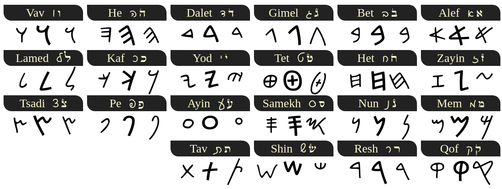
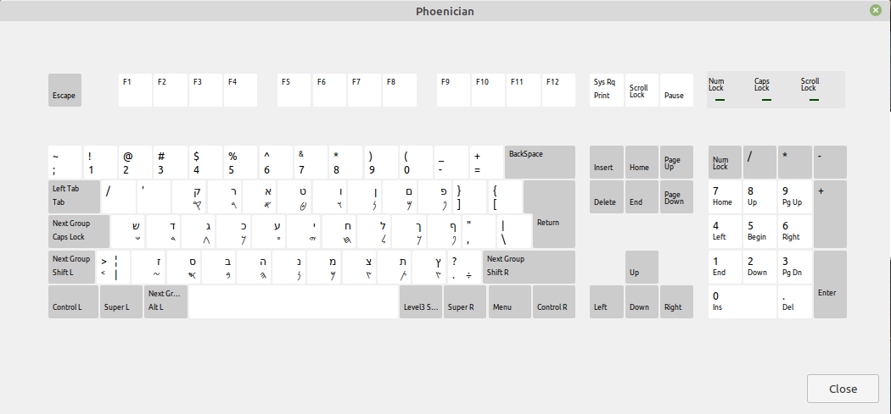
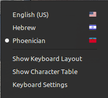

# Phoenician keyboard for linux

https://en.wikipedia.org/wiki/Phoenician_alphabet





#### install via wget

```shell
sudo sh -c "$(wget -O- https://raw.githubusercontent.com/IlanFrumer/phoenician-keyboard/master/inst.sh)"
```


#### uninstall via wget
```shell
sudo sh -c "$(wget -O- https://raw.githubusercontent.com/IlanFrumer/phoenician-keyboard/master/unst.sh)"
```
